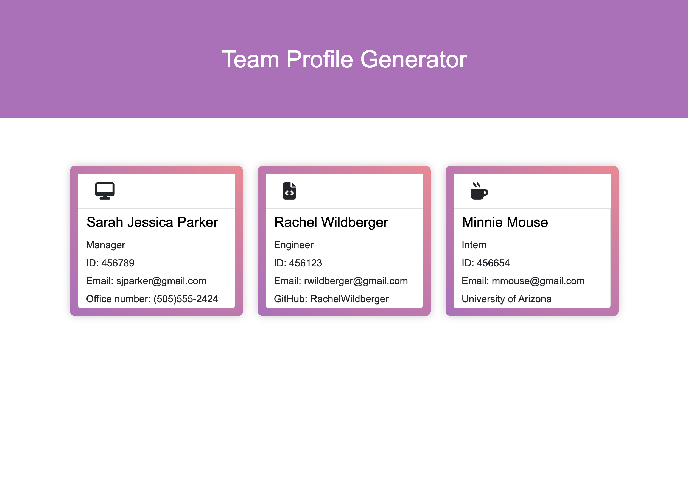

# Team-Profile-Generator

  ## Table of Contents
  - [Description](#description)
  - [Installation](#installation)
  - [Useage](#useage)
  - [Testing](#testing)
  - [Collaborators](#ollaborators)
  - [Questions](#questions)

  ## Description 
  Built a Node.js command-line application that takes in information about employees on a software engineering team and generates an HTML webpage that displays summaries for each person.

  ## Installation
  Installation of [Inquirer](https://www.npmjs.com/package/inquirer)
  *  Use ``npm install inquirer@8.2.4``

  Installation of [Jest](https://jestjs.io/)
  * Use ``npm install``

  ## Useage 
  This application will be invoked by using the following command: ``node index.js`` or ``npm start``. Answer the prompt questions to add a manager, engineer, or intern and a index.html file will be generated in the dist folder. To remove the generated HTML file use the ``npm run reset`` command.
  
  Watch video of how to use the Team Profile Generator: [here](https://drive.google.com/file/d/1WgcexPT4YuhTkm7_MJa2uZAM3aJrpXm7/view).

  ## Testing 
  Created testing for each part of the code and ensured that it passed all of them. For running the unit tests use [Jest](https://jestjs.io/) and run the suit of tests with the ``npm test`` command.

  ## Collaborators 
  n/a

  ## Questions?

  GitHub: [@RachelWildberger](https://github.com/RachelWildberger)

  Email: rachelwildberger@icloud.com